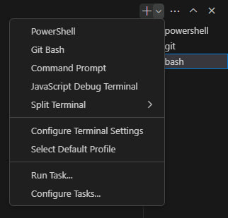
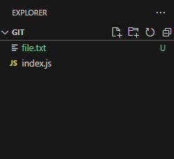
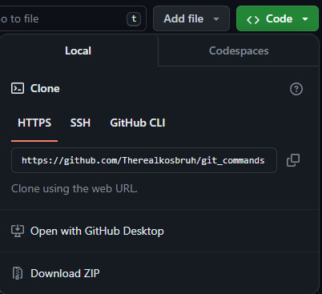
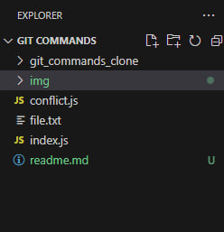

# Работа с командами Git
### Устанока рабочей среды
+ Установите командную строку [Gitbash](https://git-scm.com/downloads)
+ Установите редактор кода [Visual Studio Code](https://code.visualstudio.com/download)
+ Создайте папку на рабочем столе и перенесите её в текстовый редактор
+ Командой **Ctrl+Shit+`** откройте терминал и поменяйте его значение на bash 


### Создание и инициализация папки
___

+ Зарегистрируйтесь на [Github](https://github.com/)
+ Создайте репозиторий на ресурсе Github
+ Добавьте в папку в редакторе кода текстовый документ
+ Введите команды для инициализации репозитория в терминал
    + ```$ git config --global user.name "Therealkosbruh"```  - ваш логин
    + ```$ git config --global user.email "realkoslulz@gmail.com"```  - ваша почта
    + ```$ git init ``` - инициализация папки
    + ```$ git add file.txt ``` - добавление, созданного ранее текстового документа
    + ``` $ git commit -m "Created first file file.txt" ``` - создание commit
    + ``` $ git remote add origin https://github.com/Therealkosbruh/git_commands.git" ``` - добавление ссылки на репозиторий
    + ```$ git push -u origin master ``` - выложите документ в репозиторий Git
### Добавление параграфов в файл file.txt
  + Вставте в ваш текстовый документ новый абзац и сохраните его комбинацией **Ctrl + S**
  + Введите команды в термининал
    + ```$ git add file.txt ``` - определение рабочего файла
    + ```$ git commit -m "added second paragraph text.txt"``` - создание commit'a к изменению
    + ```$ git push ``` - выложите измененный файл в репозиторий
#### Повторите данную операцию 5 раз, изменяя порядковый номер абзаца в commit
+ ```$ git status ``` - узнайте статус репозитория

### Создание и добавление нового файла
+ В редакторе кода, создайте новый файл с индексом js 



+ Для добавления этого файла в репозиторий введите команды в терминал
    + ```$ git add index.js ```
    + ```$ git commit -"add new file" ```
    + ```$ git push ```
+ Внесите изменения в файл index.js и повторите операцию из прошлого пункта
+ Отмените изменения в файле index.js
  +  ```$ git log index.js ``` - просмотр commit'ов
  +   ```$ git log --oneline index.js ``` - просмотрите и скопируйте commit hash нужных commit
  +   ```$ git diff ``` - сравните их
  +   ```$ git rever hash ``` - вставьте вместо hash, hash commit'a 

## Ветви
 <h5>Для работы с ветвями выполните следующие команды<h5>

+ ```$ git branch ``` - просмотр существующих ветвей
+ ```$ git branch first-branch ``` - создание новой ветви
+ ```$ git checkout first branch ``` - переключение на новую ветвь
+ ```$ git checkout -b newbranch``` - создание и переключение на новую ветвь 
+ ```$ git branch -D first-branch ``` - полное удаление ветви

### Merge ветвей, создание и разрешение конфликтов
___
<p>Создайте 2 ветви, создайте файл с индексом js, сохраните его в одну из ветвей<p>

+ ```$ git branch branch-one ``` - создание новой ветви
+ ```$ git branch branch-two ``` - создание новой ветви
+ ```$ git chekout branch-one``` - переключитесь на одну из веток
+ ```$ git add conflict.js``` - добавьте файл
+ ```$ git commit -m "conflict file"```
+ ```$ git push```
  
<p>Измените этот файл и вставьте его во вторую ветку<p>

<p>Сделайте merge этих веток в ветку master<p>

+ ```$ git checkout master``` - переключитесь на главну ветку
+ ```$ git merge branch-one ``` - merge первой ветки
+ ```$ git merge branch-two ``` - merge второй ветки  
+ ```$ git diff --name-only --diff-filter=U --check all files which has conflicts ``` - просмотр всех конфликтных файлов (на выходе: conflict.js)

<p>Удалите нежелаемые изменения и сохраните файл conflict.js<p>
<p>Далее выполните команды в терминале<p>

+ ```$ git add conflict.js ``` - добавьте измененный файл conflict.js, с решенным конфликтом
+ ```$ git commit -m "conflict has resolved" ``` - добавьте commit
+ ```$ git log conflict.js ``` - протокол commit, возьмите hash
+ ```$ git checkout 2cbc4c762e514fa2381252148ce6c6092a32c257 ``` - переключитесь на заданный commit

### Rebase веток
___

+ ```$ git rebase branch-one ``` - сделайте rebase для выбранной ветви
+ ```$ git branch -d branch-one ``` - удалите ветвь
+ ```$ git rebase --skip ``` - пропустить конфликт
+ ```$ git push -u origin branch-two ``` - выложить ветвь на удаленный репозиторий
+ ```$ git fetch origin ``` - забрать изменения удаленной ветки из репозитория основной ветки по умолчанию

### Клонирование репозитория
___
<p>Скопируйте ссылку на ваш репозиторий<p>

<p>Клонируйте репозиторий в папку проекта</p> 

```$ git clone https://github.com/Therealkosbruh/git_commands.git git_commands_clone ``` - вставьте вашу ссылку и имя репозитория
<p>После выполнения команды в вашей рабочей папке появится клон репозитория<p>


